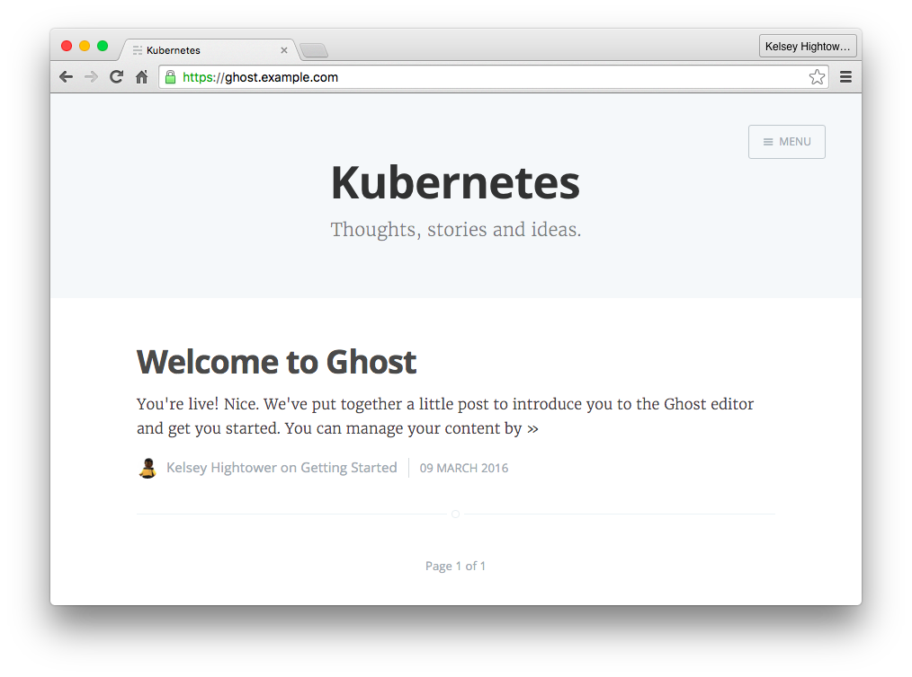

# Kubernetes 1.2 Demo (Ghost)

This tutorial will walk you through deploying [Ghost](https://ghost.org),
A publishing platform for professional bloggers, using Kubernetes 1.2 features.

At the end of this tutorial you will know how to containerize Ghost using Docker
and deploy it using Kubernetes.

 

## Prerequisites 

### Database

Create a [Cloud SQL database instance](https://cloud.google.com/sql/docs/create-instance).


```
mysql -u root -p -h <cloud-sql-host> --ssl -p
```

```
CREATE USER 'ghost'@'%' IDENTIFIED BY '<database-password>';
CREATE DATABASE ghost;
GRANT ALL ON ghost.* TO 'ghost'@'%';
FLUSH PRIVILEGES;
```

### TLS Certificates

```
ls -1 tls/
```
```
ca.crt
tls.crt
database-ca.crt
tls.key
```

## Deploying Ghost with Kubernetes

### Store Server Certificates

```
kubectl create secret generic ghost-tls --from-file=tls/
```
```
secret "ghost-tls" created
```


```
kubectl describe secrets ghost-tls
```

```
Name:        ghost-tls
Namespace:   default
Labels:      <none>
Annotations: <none>

Type:        Opaque

Data
====
tls.key:         1679 bytes
ca.crt:          1363 bytes
database-ca.crt: 1146 bytes
tls.crt:         1440 bytes
```

### Store the Ghost configuration file in a Secret

```
kubectl create secret generic ghost --from-file=configs/config.js 
```

```
secret "ghost-tls" created
```

```
kubectl describe secret ghost
```

### Store the Ghost Nginx config in configmap

```
kubectl create configmap nginx-ghost --from-file=configs/ghost.conf
```

### Create the Ghost deployment

```
kubectl create -f deployments/ghost.yaml
```

```
kubectl describe deployment ghost
```

### Expose the Ghost deployment

```
kubectl create -f services/ghost.yaml
```

```
gcloud compute firewall-rules create allow-130-211-0-0-22 \
  --source-ranges 130.211.0.0/22  --allow tcp:32000
```

### Create the Ghost ingress controller

```
kubectl create -f ingress/ghost.yaml
```

```
kubectl describe ingress ghost
```

### Scale the ghost deployment

Edit `deployments/ghost.yaml` and update the number of replicas:

```
spec:
  replicas: 3
```

Update the ghost deployment:

```
kubectl apply -f deployments/ghost.yaml
```


```
kubectl describe deployment ghost
```

```
kubectl get replicaset
```

### Deploy a canary

```
kubectl apply -f deployments/ghost-canary.yaml
```

### Roll out a new version

Edit `deployments/ghost.yaml` and update the image:

```
- name: "ghost"
  image: "kelseyhightower/ghost:0.7.8"
```

Update the ghost deployment:

```
kubectl apply -f deployments/ghost.yaml
```

